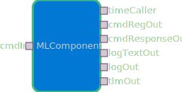

# Components::MLComponent

Functional Description: The ML Manager component handles machine learning operations by configuring model parameters, facilitating selection from the model library, executing specified models, and monitoring operational progress throughout the model lifecycle.

MLComponent uses [fprime-python](https://github.com/fprime-community/fprime-python/tree/c362eea68467a5fb7190943b02b73d4b01e941fe) to run Python code in F Prime.

## Usage Examples

Add ML resources as a submodule (example uses [Scales-ML](https://github.com/BroncoSpace-Lab/Scales-ML)) to add ML models. 

## Requirements

| Name | Description | Validation |
|---|---|---|
|MLM-001|The component shall execute the specified model upon command.|---|
|MLM-002|The component shall monitor and report on model execution status and progress.|---|
|MLM-003|The component shall provide parameter configuration capabilities to define model behavior.|---|
|MLM-004|The component shall be able to run ML models coded in Python.|---|
|MLM-005|The component shall be able to run at least 3 ML model formats.|---|

### Diagrams

### Typical Usage

1. Set the ML path with `SET_ML_PATH` command to be the file path of where your ML model is saved.
2. Set the inference path with `SET_INFERENCE_PATH` command to be the file path of the folder where the data to be inferenced is saved.
3. Run the `MULTI_INFERENCE` command to run the ML model on the selected data.
4. Output will appear in the fprime-gds.
5. Use `CLEAR_INFERENCE_PATH` to reset the data path if desired.

## Class Diagram
Add a class diagram here

## Port Descriptions

No component-specific ports.

## Component States

No state machines.

## Sequence Diagrams
Add sequence diagrams here

## Parameters
 No parameters.

## Commands
| Name | Description |
|---|---|
|SET_ML_PATH|Set the file path for the ML model.|
|SET_INFERENCE_PATH|Set the file path for the data to be inferenced.|
|MULTI_INFERENCE|Run specified model on selected data.|
|CLEAR_INFERENCE_PATH|Reset the file path for the data to be inferenced.|

## Events
| Name | Description |
|---|---|
|MLSet|Event to output the ML path set.|
|InferenceSet|Event to output the inference path set.|
|InferenceOutput|Event to output inference results.|

## Telemetry
| Name | Description |
|---|---|
|---|---|

## Unit Tests
Add unit test descriptions in the chart below
| Name | Description | Output | Coverage |
|---|---|---|---|
|---|---|---|---|

## Change Log
| Date | Description |
|---|---|
|---| Initial Draft |