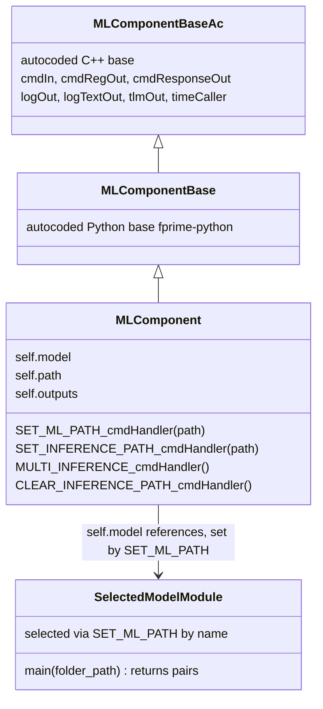
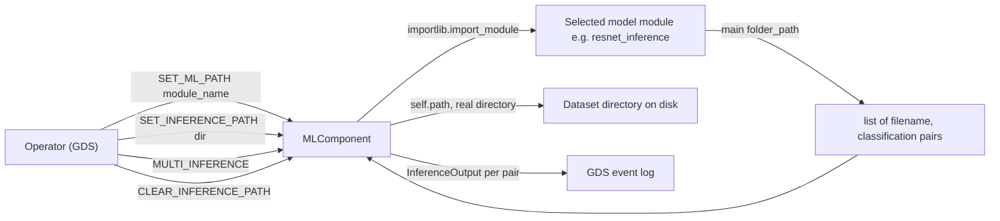
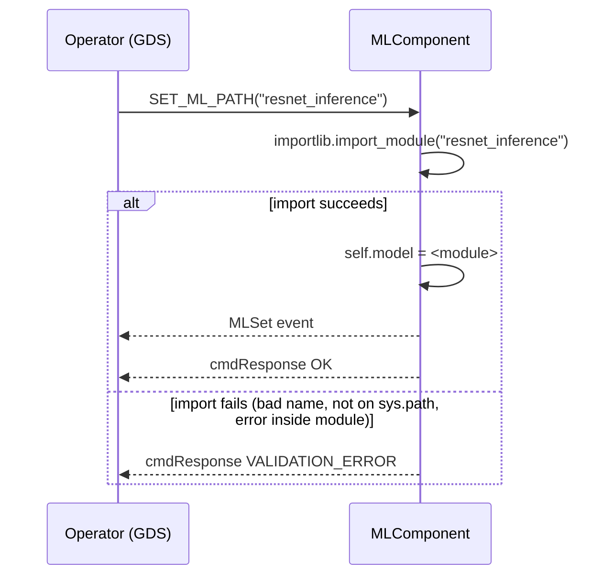
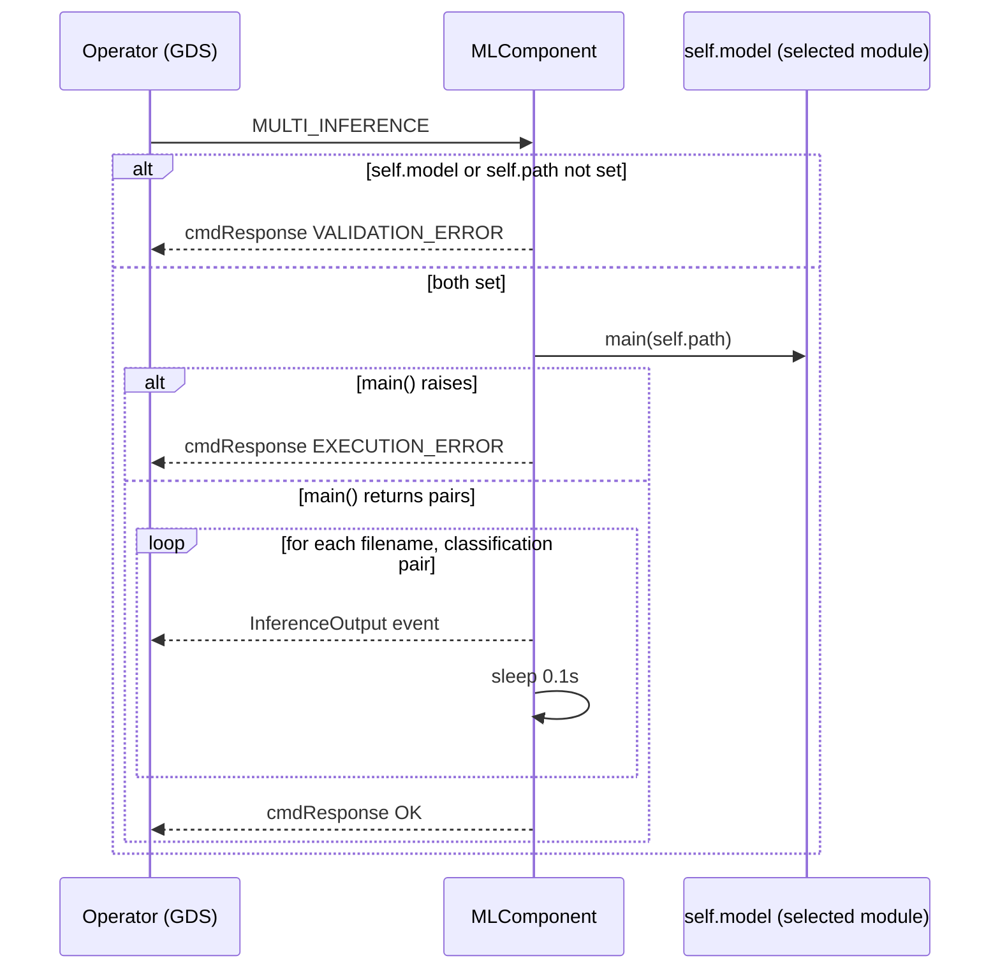

# Components::MLComponent

An operator-driven tool for running a machine-learning inference script
against a folder of data and reporting the results back through GDS. It is
instantiated once in `JetsonDeployment` as `jetson_mlManager`
([JetsonDeployment/Top/instances.fpp:22](../../../JetsonDeployment/Top/instances.fpp)),
since the Jetson is the board with the GPU and the ML/PyTorch software stack
in this deployment.

`MLComponent` is implemented in Python using
[fprime-python](https://github.com/fprime-community/fprime-python/tree/c362eea68467a5fb7190943b02b73d4b01e941fe),
not C++. This document records the implemented design, explains why the
commands behave the way they do (some of it is genuinely unintuitive from
the names alone), and walks through how to add a new model, select it, and
point it at a dataset.

## Design Summary

### Why this component is Python instead of C++

Every other component in this codebase is C++. `MLComponent` is the one
exception, and the reason is upstream, not architectural preference: the
actual inference code lives in `Scales-ML` (a nested git repository under
`Components/MLComponent/Scales-ML/`) and is written against `torch`,
`transformers`, and `datasets` -- the standard Python ML ecosystem. Those
libraries don't have a C++ equivalent worth reimplementing against; the
practical way to run a HuggingFace model is to run Python. fprime-python
exists precisely for cases like this: it autocodes the same
port/command/event plumbing any F Prime component gets from its `.fpp` file,
but lets the handler bodies be written in Python instead of C++, so this
component can call directly into `Scales-ML`'s scripts with no C++/Python
bridging code of its own.

Concretely, that means two files define this component, not one:
`MLComponent.fpp` declares the interface and autocodes `MLComponentBaseAc`
(C++) and `MLComponentBase` (its Python-facing counterpart, generated into
`MLComponentBaseAc.py`), and `MLComponent.py` subclasses `MLComponentBase`
and implements the four command handlers. `MLComponent.template.py` is the
blank scaffold fprime-python generates for that second file -- every handler
starts as a `# TODO: Implement command handler` stub that just replies `OK`;
compare it against `MLComponent.py` to see exactly what was filled in.

### Why `SET_ML_PATH` takes a module name, not a file path

This is the single most important, and most misleading, thing about this
component: despite the command's name and its `.fpp` doc comment ("Set the
file path for the ML model"), the string you give `SET_ML_PATH` is not a
filesystem path at all. It's a **Python module name**.

[MLComponent.py:30-39](../MLComponent.py) shows exactly what happens:

```python
def SET_ML_PATH_cmdHandler(self, opCode, cmdSeq, path):
    try:
        self.model = importlib.import_module(str(path))
    except Exception:
        ...VALIDATION_ERROR...
```

`importlib.import_module(name)` is the same call Python's own `import name`
statement uses internally. It only succeeds if `name` is something Python
can already find on `sys.path` -- it does not search the filesystem for a
file matching the string you typed, and it will happily accept a name that
doesn't look like a path at all (`resnet_inference`, not
`/home/.../resnet_inference.py`). If it succeeds, whatever module object
comes back is stored as `self.model` and an `MLSet` event is logged; if it
raises for any reason (typo, module not on the path, import-time error
inside the module itself), the command is rejected with `VALIDATION_ERROR`
and nothing is stored.

Because `self.model` is a live Python module reference, whatever it points
to is exactly what `MULTI_INFERENCE` will later call `.main()` on -- see
below.

### Why `SET_INFERENCE_PATH` is different -- it really is a path

`SET_INFERENCE_PATH` is not the same kind of value. Its job is to say *where
the data to run inference on lives*, and that genuinely is a directory on
disk:

```python
def SET_INFERENCE_PATH_cmdHandler(self, opCode, cmdSeq, path):
    path_str = str(path)
    if not os.path.isdir(path_str):
        ...VALIDATION_ERROR...
    self.path = path_str
```
([MLComponent.py:49-61](../MLComponent.py))

`os.path.isdir()` is a real filesystem check -- the string must name a
directory that exists on the machine `MLComponent` is running on (the
Jetson) at the moment the command runs. There's no relationship between
this value and `SET_ML_PATH`'s value beyond both being called "path" in the
`.fpp`; one selects *which code runs*, the other selects *what data it runs
against*. Treat them as two independent settings, not two parts of one
configuration.

### The contract every model module must satisfy

`MULTI_INFERENCE` is what actually connects the two settings above:

```python
def MULTI_INFERENCE_cmdHandler(self, opCode, cmdSeq):
    if self.model is None or self.path is None:
        ...VALIDATION_ERROR...
    try:
        self.outputs = self.model.main(self.path)
    except Exception:
        ...EXECUTION_ERROR...
    if self.outputs:
        for file, classification in self.outputs:
            self.log_ACTIVITY_HI_InferenceOutput(str(file), str(classification))
            time.sleep(0.1)
```
([MLComponent.py:69-100](../MLComponent.py))

This is a hard, undocumented-elsewhere interface contract: whatever module
you select with `SET_ML_PATH` **must** define a top-level function

```python
def main(folder_path) -> Iterable[tuple[str, str]]:
    ...
```

that accepts the dataset directory (the value from `SET_INFERENCE_PATH`) and
returns something iterable of `(filename, classification)` pairs. Each pair
becomes one `InferenceOutput` event, logged with a `0.1`-second sleep
between each (a simple pacing measure so a large batch doesn't flood the
event pipeline downlink all at once). If `self.model.main()` raises for any
reason -- missing dependency, bad data, out-of-memory on the GPU, whatever
-- the command comes back `EXECUTION_ERROR` and no events are logged for
that run. If it returns `None` or an empty sequence, no events are logged
either, but the command still reports `OK`.

**Checked every model script actually present in `Scales-ML` against this
contract.** Only one satisfies it as-is:

| Script | `main()` signature | Returns `(file, classification)` pairs? | Usable via `SET_ML_PATH` today |
|---|---|---|---|
| `Scales-ML/resnet/resnet_inference.py` | `main(folder_path, model_name=...)` | Yes -- iterates image files in `folder_path`, returns a list of `(filename, predicted_class)` | Yes |
| `Scales-ML/resnet/resnet_cifar100.py` | `main(folder_path, model_name=...)` | No -- `folder_path` is treated as a HuggingFace *dataset name*, not a local directory of images; prints results instead of returning them (implicit `None`) | No, without editing |
| `Scales-ML/resnet/resnet_fps.py` | `main(model_name=...)` | No `folder_path` parameter at all | No |
| `Scales-ML/depth/depthanything.py` | `main(folder_path)` | No -- writes depth-map outputs, doesn't return anything | No, without editing |
| `Scales-ML/mnist/*.py`, `Scales-ML/nannyml/*.py` | Various, none take a single `folder_path` argument | No | No |

In other words, most of `Scales-ML` is a library of reference scripts to
adapt, not a menu of models ready to select today. Keep this table in mind
before promising "3+ model formats" (MLM-005) actually works out of the box
-- right now only one does.

### Why `CLEAR_INFERENCE_PATH` doesn't also clear the model

```python
def CLEAR_INFERENCE_PATH_cmdHandler(self, opCode, cmdSeq):
    self.path = None
```
([MLComponent.py:102-109](../MLComponent.py))

This resets `self.path` only. `self.model` (the imported module from
`SET_ML_PATH`) is untouched. That's a deliberate asymmetry worth calling out
because the name invites the opposite assumption: after
`CLEAR_INFERENCE_PATH`, the previously-selected model is still selected --
you only need to run `SET_INFERENCE_PATH` again before the next
`MULTI_INFERENCE`, not `SET_ML_PATH` as well. There is no command that
clears `self.model`; the only way to change the selected model is to call
`SET_ML_PATH` again with a different (or the same) module name.

## Adding a New Model

Adding a model that works with `SET_ML_PATH` means two things have to be
true at once: the script has to be *importable by name* when
`MLComponent.py` runs, and it has to expose the `main(folder_path)` contract
described above.

### 1. Make the script importable

`importlib.import_module("your_module")` only finds `your_module` if
somewhere on `sys.path` there's a `your_module.py` (or a package directory
of that name). What actually populates `sys.path` at runtime is
`add_python_paths()` in
[JetsonDeployment/fsw_main.py:47-57](../../../JetsonDeployment/fsw_main.py):

```python
def add_python_paths():
    paths = [
        PYTHON_ARTIFACT_DIR,   # JetsonDeployment/
        PROJECT_ROOT,
        ML_COMPONENT_DIR,      # Components/MLComponent/
        RESNET_DIR,            # Components/MLComponent/Scales-ML/resnet/
    ]
    for path in reversed(paths):
        if os.path.isdir(path) and path not in sys.path:
            sys.path.insert(0, path)
```

Today exactly four directories are on the path, and only one of them is
inside `Scales-ML` (`Scales-ML/resnet/`). That means:

- A new model script placed in `Scales-ML/resnet/`, or directly in
  `Components/MLComponent/`, is importable with no further changes.
- A new model script placed anywhere else in `Scales-ML` (a new
  `Scales-ML/yolo/`, `Scales-ML/depth/`, a brand-new subdirectory, etc.)
  is **not** importable until someone adds that directory to the `paths`
  list above and `JetsonDeployment` is rebuilt/redeployed. This is a real,
  easy-to-hit gap -- it's why `depthanything.py` (which is close to the
  contract already) can't be selected via `SET_ML_PATH` today even if you
  fixed its `main()` to return the right shape.

### 2. Match the `main()` contract

```python
def main(folder_path):
    """folder_path is exactly what was set via SET_INFERENCE_PATH."""
    results = []
    for filename in os.listdir(folder_path):
        ...
        results.append((filename, classification_string))
    return results
```

`resnet_inference.py` is the reference implementation of this shape --
copy its pattern (list the directory, run the model per file, collect
`(filename, label)` tuples, return the list) for a new model rather than
starting from scratch.

### 3. Select it

Once both of the above are true, the model is selected the same way any
other one is:

```
SET_ML_PATH resnet_inference
SET_INFERENCE_PATH /path/to/a/folder/of/images
MULTI_INFERENCE
```

No rebuild is needed for step 3 by itself -- `importlib.import_module`
happens at command time, not at build time, so switching between
already-importable models is just re-sending `SET_ML_PATH` with a different
name. A rebuild is only needed when the *set of importable directories*
changes (step 1).

(Aside: `MLComponent.py` also has `import resnet_cifar100` and
`import resnet_inference` at the top of the file, ahead of the class
definition -- [MLComponent.py:11-12](../MLComponent.py). That's not a
whitelist or a restriction on what `SET_ML_PATH` can select; it just
guarantees those two specific modules are imported once at process startup
(so an import-time error in either surfaces immediately in the logs rather
than silently later, the first time an operator happens to select it).
`importlib.import_module` can still resolve any importable name, whether or
not it happens to already be pre-imported here.)

## Operational Notes: why there's no dropdown for these paths in GDS

Both `SET_ML_PATH` and `SET_INFERENCE_PATH` are declared `string size 254`
in [MLComponent.fpp:11-13,21-23](../MLComponent.fpp) -- plain free-text
parameters. F Prime's GDS only auto-renders a dropdown/select control for a
command parameter when its `.fpp` type is an `enum`; GDS has no mechanism
for a "dynamic" dropdown populated from something the flight software
reports live. A `string` parameter is always a free-text box.

Converting either parameter to an `enum` would get a dropdown, but at a real
cost: an `enum`'s value list is fixed at compile time. `SET_ML_PATH` would
have to be re-declared and the deployment rebuilt every time a model is
added (defeating the "drop a script into `Scales-ML/resnet/` and select it"
workflow above), and `SET_INFERENCE_PATH` fundamentally can't be an `enum`
at all -- its valid values are "any directory that happens to exist on the
Jetson at the time," which isn't a fixed set. This only makes sense if the
model/dataset list is meant to be small and curated (e.g., "these are the N
flight-qualified models," changed rarely and deliberately) -- worth
considering if that becomes the operational reality, but it's a real
trade-off, not a strict improvement over today.

A lighter-weight option that doesn't require giving up flexibility: add a
read-only command (e.g. `LIST_AVAILABLE_MODELS`) that reports, via an event,
which module names are actually importable right now, so an operator can
see valid choices before typing instead of guessing or checking source.
This is a suggestion for future work, not implemented as part of this
document.

## Functional Diagrams

### Class Diagram


```mermaid
classDiagram
    class MLComponentBaseAc {
        autocoded C++ base
        cmdIn, cmdRegOut, cmdResponseOut
        logOut, logTextOut, tlmOut, timeCaller
    }
    class MLComponentBase {
        autocoded Python base fprime-python
    }
    class MLComponent {
        self.model
        self.path
        self.outputs
        SET_ML_PATH_cmdHandler(path)
        SET_INFERENCE_PATH_cmdHandler(path)
        MULTI_INFERENCE_cmdHandler()
        CLEAR_INFERENCE_PATH_cmdHandler()
    }
    class SelectedModelModule {
        selected via SET_ML_PATH by name
        main(folder_path) returns pairs
    }
    MLComponentBaseAc <|-- MLComponentBase
    MLComponentBase <|-- MLComponent
    MLComponent --> SelectedModelModule : self.model references, set by SET_ML_PATH
```

### Command Relationships


```mermaid
flowchart LR
    Op["Operator (GDS)"] -->|SET_ML_PATH module_name| MLC["MLComponent"]
    Op -->|SET_INFERENCE_PATH dir| MLC
    Op -->|MULTI_INFERENCE| MLC
    Op -->|CLEAR_INFERENCE_PATH| MLC

    MLC -->|importlib.import_module| Model["Selected model module e.g. resnet_inference"]
    MLC -->|self.path, real directory| Data["Dataset directory on disk"]
    Model -->|main folder_path| Results["list of filename, classification pairs"]
    Results --> MLC
    MLC -->|InferenceOutput per pair| GDS["GDS event log"]
```

### Sequence: `SET_ML_PATH`


```mermaid
sequenceDiagram
    participant Op as Operator (GDS)
    participant MLC as MLComponent

    Op->>MLC: SET_ML_PATH("resnet_inference")
    MLC->>MLC: importlib.import_module("resnet_inference")
    alt import succeeds
        MLC->>MLC: self.model = <module>
        MLC-->>Op: MLSet event
        MLC-->>Op: cmdResponse OK
    else import fails (bad name, not on sys.path, error inside module)
        MLC-->>Op: cmdResponse VALIDATION_ERROR
    end
```

### Sequence: `MULTI_INFERENCE`


```mermaid
sequenceDiagram
    participant Op as Operator (GDS)
    participant MLC as MLComponent
    participant Model as self.model (selected module)

    Op->>MLC: MULTI_INFERENCE
    alt self.model or self.path not set
        MLC-->>Op: cmdResponse VALIDATION_ERROR
    else both set
        MLC->>Model: main(self.path)
        alt main() raises
            MLC-->>Op: cmdResponse EXECUTION_ERROR
        else main() returns pairs
            loop for each filename, classification pair
                MLC-->>Op: InferenceOutput event
                MLC->>MLC: sleep 0.1s
            end
            MLC-->>Op: cmdResponse OK
        end
    end
```

## Operating Rules

1. `SET_ML_PATH`'s argument is resolved with `importlib.import_module()` --
   it is a Python module name that must already be importable, not a
   filesystem path. Success stores the module as `self.model` and logs
   `MLSet`; failure of any kind returns `VALIDATION_ERROR` and leaves
   `self.model` unchanged.
2. `SET_INFERENCE_PATH`'s argument is validated with `os.path.isdir()`; it
   must name a directory that exists at command time. Success stores it as
   `self.path` and logs `InferenceSet`; failure returns `VALIDATION_ERROR`
   and leaves `self.path` unchanged.
3. `MULTI_INFERENCE` requires both `self.model` and `self.path` to already
   be set, or it returns `VALIDATION_ERROR` without attempting anything.
4. `MULTI_INFERENCE` calls `self.model.main(self.path)` exactly once per
   command. Any exception raised inside that call is caught and reported as
   `EXECUTION_ERROR`; no partial results are logged for a run that raises.
5. Each `(filename, classification)` pair returned by `main()` produces one
   `InferenceOutput` event, in the order returned, with a `0.1`-second sleep
   between events. If `main()` returns nothing (`None` or empty), no events
   are logged, but the command still reports `OK`.
6. `CLEAR_INFERENCE_PATH` resets `self.path` only. `self.model` is
   unaffected and remains selected.
7. There is no command that clears or queries `self.model`; the only way to
   change the selected model is another `SET_ML_PATH` call.

## Port Descriptions

| Name | Description |
|---|---|
| `timeCaller` | Standard AC port: requests the current time for event/telemetry timestamps. |
| `cmdRegOut` | Standard AC port: registers this component's four commands with the command dispatcher. |
| `cmdIn` | Standard AC port: receives dispatched commands (`SET_ML_PATH`, `SET_INFERENCE_PATH`, `MULTI_INFERENCE`, `CLEAR_INFERENCE_PATH`). |
| `cmdResponseOut` | Standard AC port: reports each command's completion status (`OK` / `VALIDATION_ERROR` / `EXECUTION_ERROR`). |
| `logTextOut` | Standard AC port: text form of events, for the console/text log. |
| `logOut` | Standard AC port: binary form of events (`MLSet`, `InferenceSet`, `InferenceOutput`), for GDS/downlink. |
| `tlmOut` | Standard AC port: telemetry channel output. Declared but unused -- see Telemetry below. |

`MLComponent` has no component-specific ports beyond the standard AC set --
no `run` (rate-group) port, no custom input/output ports. This follows from
what it actually is: an on-demand, operator-driven tool that only does
anything in response to a command, never on a schedule and never in
response to another component's output. The commented-out example port in
`MLComponent.fpp` ("Example port: receiving calls from the rate group") was
never uncommented, and nothing in `MLComponent.py` needs it.

## Component States

`MLComponent` isn't a formal state machine (no `state machine` construct in
the `.fpp`), but it does carry meaningful state across commands, held as
plain Python instance attributes rather than modeled states:

| Attribute | Set by | Cleared by | Meaning |
|---|---|---|---|
| `self.model` | `SET_ML_PATH` (on successful import) | Nothing -- persists until the next successful `SET_ML_PATH` | The currently-selected model module. |
| `self.path` | `SET_INFERENCE_PATH` (on successful validation) | `CLEAR_INFERENCE_PATH`, or the next successful `SET_INFERENCE_PATH` | The currently-selected dataset directory. |
| `self.outputs` | `MULTI_INFERENCE` (overwritten every run) | Nothing | The most recent inference run's raw results, kept only as an internal cache; not exposed via telemetry or a command. |

`MULTI_INFERENCE` is only accepted when both `self.model` and `self.path`
are non-`None` -- see Operating Rules.

## Parameters

| Name | Description |
|---|---|
| None | `MLComponent` has no configurable parameters (no `param` declarations in the `.fpp`). |

## Commands

| Name | Description | Failure modes |
|---|---|---|
| `SET_ML_PATH` | Selects the model to use, by Python module name, via `importlib.import_module()`. Logs `MLSet` on success. | `VALIDATION_ERROR` if the name can't be imported (typo, not on `sys.path`, or an error inside the module itself). |
| `SET_INFERENCE_PATH` | Selects the dataset directory `MULTI_INFERENCE` will run against. Validated with `os.path.isdir()`. Logs `InferenceSet` on success. | `VALIDATION_ERROR` if the given string is not an existing directory. |
| `MULTI_INFERENCE` | Runs `self.model.main(self.path)` and logs one `InferenceOutput` event per `(filename, classification)` result, 0.1s apart. | `VALIDATION_ERROR` if a model and/or dataset path hasn't been set yet; `EXECUTION_ERROR` if `main()` raises. |
| `CLEAR_INFERENCE_PATH` | Resets the selected dataset directory (`self.path = None`). Does **not** clear the selected model. | None -- always returns `OK`. |

## Events

| Name | Description | Format |
|---|---|---|
| `MLSet` | Logged when `SET_ML_PATH` successfully imports a module. | `"ML Path Set: {}"` -- the module name that was set. |
| `InferenceSet` | Logged when `SET_INFERENCE_PATH` successfully validates a directory. | `"Inference Path Set: {}"` -- the directory that was set. |
| `InferenceOutput` | Logged once per `(filename, classification)` pair returned by a `MULTI_INFERENCE` run. | `"{} is an image of a {}"` -- filename, then classification. |

There is no event logged for a `VALIDATION_ERROR`/`EXECUTION_ERROR`
rejection beyond the command response itself (visible in GDS's Commands
view, not the Events view) -- worth knowing if you're watching the Events
log specifically and a command appears to do nothing.

## Telemetry

| Name | Description |
|---|---|
| None | No `telemetry` channels are declared in `MLComponent.fpp`. `tlmOut` exists only because it's part of the standard AC port set every F Prime component gets; nothing is ever sent on it. Progress/results are only observable via the `InferenceOutput` event stream, not telemetry. |

## Unit Tests

None exist today. `CMakeLists.txt`'s entire `### Unit Tests ###` block --
`UT_SOURCE_FILES`, `UT_MOD_DEPS`, `UT_AUTO_HELPERS`, and the
`register_fprime_ut()` call itself -- is commented out
([CMakeLists.txt:55-65](../CMakeLists.txt)), and there is no `test/ut/`
directory under `Components/MLComponent/`. `register_python_component(...)`
is also commented out, for a separate, already-diagnosed reason noted
in-line in the CMakeLists (the direct call fails during F Prime's
info-cache sub-build because `pybind.cmake` isn't loaded in that pass yet).

If test coverage is wanted here, the natural targets -- given fprime-python
components can't easily be driven through a normal GTest `TesterBase`
harness -- would be Python-level (`pytest`) tests against `MLComponent.py`'s
four handlers directly, mocking `self.cmdResponse_out`/`self.log_*` the way
`MLComponentBase` would normally supply them. Not implemented as part of
this document.

## Requirements

| Name | Description | Validation |
|---|---|---|
| MLM-001 | The component shall execute the specified model upon command. | Manual / operator-verified via GDS (`MULTI_INFERENCE`). No automated test. |
| MLM-002 | The component shall monitor and report on model execution status and progress. | Partially met: per-result `InferenceOutput` events and command-response status (`OK`/`VALIDATION_ERROR`/`EXECUTION_ERROR`) exist; no progress indication *during* a long-running `main()` call (the command simply blocks until it returns). Manual / operator-verified. No automated test. |
| MLM-003 | The component shall provide parameter configuration capabilities to define model behavior. | Met via `SET_ML_PATH`/`SET_INFERENCE_PATH` (component-level configuration, not F Prime `param`s -- see Parameters). Manual / operator-verified. No automated test. |
| MLM-004 | The component shall be able to run ML models coded in Python. | Met by design (fprime-python + `importlib.import_module`). Manual / operator-verified. No automated test. |
| MLM-005 | The component shall be able to run at least 3 ML model formats. | **Not currently met.** Only `Scales-ML/resnet/resnet_inference.py` satisfies the `main(folder_path)` contract today -- see the model-compatibility table under "Adding a New Model." Reaching 3 requires either adapting more `Scales-ML` scripts to the contract or writing new ones. |

## Change Log

| Date | Description |
|---|---|
| --- | Initial Draft |
| 2026-07-31 | Full rewrite: documented the actual implemented behavior in `MLComponent.py` (in particular, that `SET_ML_PATH` selects a Python module by name via `importlib.import_module`, not a filesystem path -- correcting the previous draft's description). Added "Adding a New Model" (the `main(folder_path)` contract and the `sys.path`/`add_python_paths()` mechanism that governs which scripts are importable), an "Operational Notes" section answering why GDS can't show a dropdown for these commands today, class/sequence diagrams, filled-in Port Descriptions/Component States/Commands/Events/Telemetry/Requirements tables, and an honest "no unit tests exist yet" Unit Tests section. Documentation-only; no functional changes. | Luca Lanzillotta |
