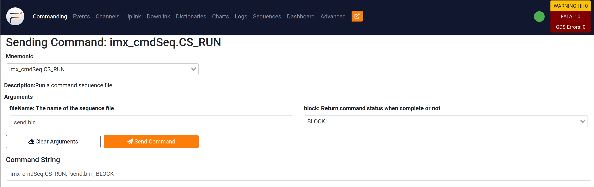
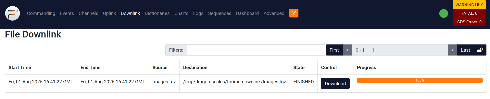

# fprime-scales-ref F' project

Watch our video demo on [YouTube](https://youtu.be/-g3Wv_fr9r8?si=2xow8_22aNjE1XDO)!

Check out our [docs page](https://scales-docs.readthedocs.io/en/latest/)!

### Development Environment

May or may not be required, but this is what we found best to use for development:

- Ubuntu 22.04 host machine
- python3.11
- git lfs (install [here for amd64](https://git-lfs.com/) and [here for arm64](https://github.com/git-lfs/git-lfs/releases/download/v3.7.0/git-lfs-linux-arm64-v3.7.0.tar.gz))

## How to Clone

Use the commands below in terminal to clone and set up the repository. Make sure to source the fprime-venv before you continue developing! **Make sure you have [git lfs](https://git-lfs.com/) installed before proceeding.**

```
git clone https://github.com/BroncoSpace-Lab/fprime-scales-ref.git
cd fprime-scales-ref
make setup
make arena-init
source fprime-venv/bin/activate
```

### Necessary Changes

Some lines need to be commented in `lib/fprime/cmake/API.cmake` in order to use `fprime-python`. Comment out lines [545](https://github.com/nasa/fprime/blob/5a3b873854fe4d646d6874d134585535652fddb9/cmake/API.cmake#L545) and [562](https://github.com/nasa/fprime/blob/5a3b873854fe4d646d6874d134585535652fddb9/cmake/API.cmake#L562).

After this, you should be good to go!

## How to Build JetsonDeployment

You must generate build JetsonDeployment on the Jetson, we have not set up cross-compilation for aarch64-linux yet.

**On the Jetson**, should be able to generate and build the JetsonDeployment with the commands below:

```
fprime-util generate aarch64-linux -f
make build-jetson
```

The `make build-jetson` command will `fprime-util build aarch64-linux` and create a linked folder for the camera images. This command also runs a script to create the build environment for fprime-python on the Jetson.

## ImxDeployment

To correctly generate and build for the IMX, you need to have the build environment on your machine. Refer to [this guide](https://scales-docs.readthedocs.io/en/latest/imx_yocto_bsp/#building-the-bsp) we made on our docs for how to set up the IMX SDK.

Generate and build the ImxDeployment on your host machine with the commands below:

```
fprime-util generate imx8x -f && fprime-util build imx8x -j20
```

# To Run the SCALES Demo

## IMX Setup

These steps are only required if there are changes made to ImxDeployment. Otherwise, the binary on the IMX should be fine.

1. Follow the instructions above to build ImxDeployment on the host machine. Use the following command to ssh into the IMX.

    ```
    ssh root@<ip of imx> -o HostKeyAlgorithms=+ssh-rsa -o PubKeyAcceptedAlgorithms=+ssh-rsa
    ```

2. Make sure you are able to ping both the host machine and the Jetson from the IMX. Copy the ImxDeployment binary from the host machine to the IMX. (Run this command on the host machine.)

    ```
    scp -oHostKeyAlgorithms=+ssh-rsa -oPubkeyAcceptedKeyTypes=+ssh-rsa ~/fprime-scales-ref/build-artifacts/imx8x/ImxDeployment/bin/ImxDeployment root@<ip of imx>:~/.
    ```

3. Copy the binary files for the sequences to the IMX.

    ```
    scp -oHostKeyAlgorithms=+ssh-rsa -oPubkeyAcceptedKeyTypes=+ssh-rsa ~/fprime-scales-ref/save-png.bin root@<ip of imx>:~/.
    scp -oHostKeyAlgorithms=+ssh-rsa -oPubkeyAcceptedKeyTypes=+ssh-rsa ~/fprime-scales-ref/batch-send-img.bin root@<ip of imx>:~/.
    ```

## Jetson Setup

1. On the Jetson, follow the above directions to generate and build JetsonDeployment.

2. Change the IP of the IMX in `Jetsondeployment/Top/JetsonDeploymentTopology.cpp` to match the IP of the IMX.

    ```
    // line 32
    const char* REMOTE_HUIP_ADDRESS = "10.3.2.2"; // ip of JPL IMX
    // const char* REMOTE_HUIP_ADDRESS = "192.168.0.66"; // ip of CPP IMX
    const U32 REMOTE_HUPORT = 50500;
    ```

3. Rebuild JetsonDeployment.

    ```
    make build-jetson
    ```

4. **For first time setup only:** Make a folder with a symbolic link to where the camera images are saved. This is done to assure the paths for commands in the fprime-gds are not too long.

    ```
    sudo ln -s ~/fprime-scales-ref/build-python-fprime-aarch64-linux/Images/ ./Images
    ```

    The `Images` folder will be created in your root directory.

## Host Setup

1. Open another terminal on the host machine and enter the directory for the repo and source your environment.

    ```
    cd fprime-scales-ref
    source fprime-venv/bin/activate
    ```

2. Copy the ImxDeployment dictionary to the GDS-Dictionary folder on the host machine. Run this command on the host machine.

    ```
    cp ~/fprime-scales-ref/build-artifacts/imx8x/ImxDeployment/dict/ImxDeploymentTopologyAppDictionary.xml ~/fprime-scales-ref/GDS-Dictionary/.
    ```

3. Copy the JetsonDeployment dictionary from the Jetson to the host machine. Run this command on the host machine.

    ```
    scp <jetson name>@<jetson IP>:~/fprime-scales-ref/build-artifacts/aarch64-linux/JetsonDeployment/dict/JetsonDeploymentTopologyAppDictionary.xml ~/fprime-scales-ref/GDS-Dictionary/.
    ```

6. Combine the GDS dictionaries with the `merger.py` script. Run this command on the host machine.

    ```
    cd GDS-Dictionary
    python merger.py JetsonDeploymentTopologyAppDictionary.xml ImxDeploymentTopologyAppDictionary.xml GDSDictionary.xml
    ```

You are now ready to run the demo!

## Running the Demo

1. After you finished setting up the demo in the previous section, **on the host machine**, navigate to the `GDS-Dictionary` folder and run the fprime-gds.

    ```
    fprime-gds -n --dictionary GDSDictionary.xml --ip-client --ip-address <ip of imx>
    ```

2. **On the IMX**, run the ImxDeployment binary. You should see a green dot on the fprime-gds and "Accepted client" in the IMX terminal.

    ```
    ./ImxDeployment -a 0.0.0.0 -p 50000
    ```

3. **On the Jetson**, navigate to the `build-python-fprime-aarch64-linux` directory to run the fprime-gds using python.

    ```
    cd build-python-fprime-aarch64-linux
    python -c "import python_extension; python_extension.main()"
    ```

    This command opens the python environment and connects to the IMX's fprime-gds using the hub pattern. If you want to exit the python environment, the command is `exit()`.

4. **On the host machine**, use the fprime-gds to run the `jetson_cmdDisp.CMD_NO_OP` to test the connection with the Jetson. Do the same for the IMX with the `imx_cmdDisp.CMD_NO_OP`. You should be able to see that both events completed in the "Events" tab of the gds.

5. Once the camera is connected, run the `jetson_lucidCamera.SETUP_CAMERA` command to verify the connection via fprime.

6. To take a picture with the Ethernet Camera, run a sequence on the IMX using the `imx_cmdSeq.CS_RUN` command on the fprime-gds with fileName argument `snap-n-save.bin`. The Command String is as follows:

    ```
    imx_cmdSeq.CS_RUN, "snap-n-save.bin", BLOCK
    ```

    <div style="text-align: center;">
    
    </div>
    
    This sequence will trigger the Images from the Jetson to be downlinked to the IMX, and then again downlinked from the IMX to the Host Machine. Check the `Downlink` tab in the GDS to see the images.

    <div style="text-align: center;">
    
    </div>

    Click the `Download` button in the `Downlink` tab of the fprime-gds to download the zipped Image folder to the host machine. You can then unzip the folder and view the images from the Jetson!

7. If you would like to send a batch of images from the Jetson to the Host Machine, run a sequence on the IMX using the `imx_cmdSeq.CS_RUN` command on the fprime-gds with fileName argument `send.bin`. The Command String is as follows:

    ```
    imx_cmdSeq.CS_RUN, "send.bin", BLOCK
    ```

    <div style="text-align: center;">
    
    </div>
    
    This sequence will trigger the Images from the Jetson to be zipped into a smaller file to be downlinked to the IMX, and then again downlinked from the IMX to the Host Machine.

    <div style="text-align: center;">
    
    </div>

    Click the `Download` button in the `Downlink` tab of the fprime-gds to download the zipped Image folder to the host machine. You can then unzip the folder and view the images from the Jetson!

7. To run ML on the images, run the `mlManager.SET_ML_PATH` command with argument `resent_inference`. Then, set the inference path to where the images are stored with the `mlManager.SET_INFERENCE_PATH` command with argement `../Images`. Finally, run the ML model with command `mlManager.MULTI_INFERENCE`. You should see the results of the ML model both in the Jetson's terminal and in the Jetson's fprime-gds Events log.

That's how to run the SCALES demo!

Watch our video demo on [YouTube](https://youtu.be/-g3Wv_fr9r8?si=2xow8_22aNjE1XDO)! Some minor changes have been implemented since the creation of this video, but the core process remains the same.

# To Run Scales-ML

[Scales-ML](https://github.com/BroncoSpace-Lab/Scales-ML/tree/e3aa59f606e9325cd198b787543cea0341d9a19a)

1. Follow the setup described in previous sections for the IMX, Jetson, and Host Machine.

2. In the fprime-gds, run the `imx_cmdSeq.CS_RUN` command with argument `test-resnet.bin`. This sequence will:

    - Set the ML path to a resnet model
    - Set the inference path to a folder called `test-imagery` with example images
    - Execute the `MULTI_INFERENCE` command to inference on all images in that folder.

# To Run Scales-ML

[Scales-ML](https://github.com/BroncoSpace-Lab/Scales-ML/tree/e3aa59f606e9325cd198b787543cea0341d9a19a)

1. Follow the setup described in previous sections for the IMX, Jetson, and Host Machine.

2. In the fprime-gds, run the `imx_cmdSeq.CS_RUN` command with argument `test-resnet.bin`. This sequence will:

    - Set the ML path to a resnet model
    - Set the inference path to a folder called `test-imagery` with example images
    - Execute the `MULTI_INFERENCE` command to inference on all images in that folder.

---

This project was auto-generated by the F' utility tool. 

F´ (F Prime) is a component-driven framework that enables rapid development and deployment of spaceflight and other embedded software applications.
**Please Visit the F´ Website:** https://fprime.jpl.nasa.gov.
